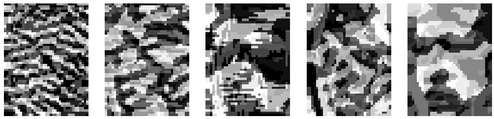
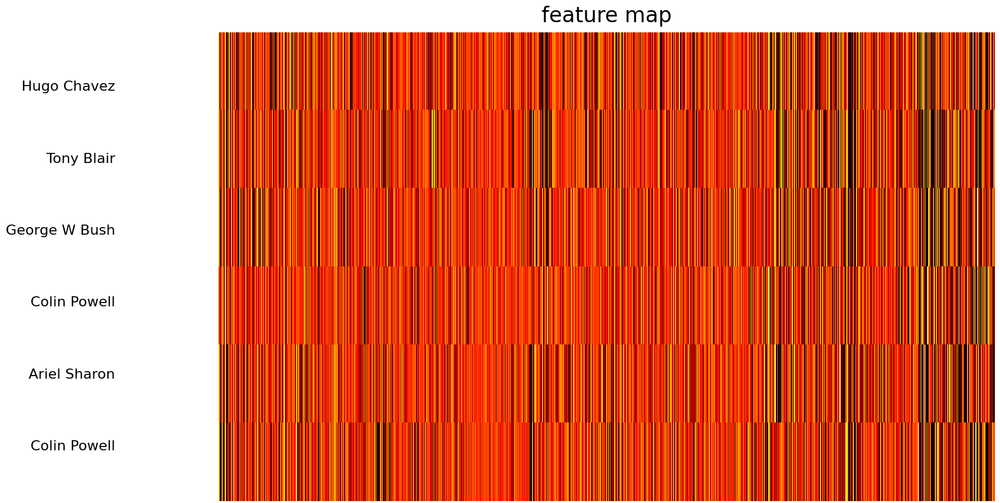

# PcaNet applied to face classification

We implemented the PCA network described in following reference:

> *PCANet: A Simple Deep Learning Baseline for Image Classification?*, Tsung-Han Chan, Kui Jia, Shenghua Gao, Jiwen Lu, Zinan Zeng, and Yi Ma, 2014

PcaNet is a model of feature extraction for images. We evaluated the PcaNet model on **Labeled Faces in the Wild** (LFW) dataset using an SVM as a classifier.

## Summary of the method

* PcaNet is a model which computes a **cascade of convolutions**. At each level of the network **filters** are learnt using PCA. It is achieved by first **sampling patches** from dataset. Then PCA learns an **orthogonal basis of patches** which allows to decompose any patch in this new basis so that it minimizes the loss of information. 

  

* Once filters are learnt inference is done by applying a sequence of 2D convolutions.

  

* A **binary hashing step** binarize outputs. For each pixel it provides a binary sequence, hence an integer. At this step we added a sparsity parameter not introduced by authors. 

  

  

  

* Finally hashed outputs are encoded by **blocks of histograms** and we obtain our feature map.

  

* For a 2 layers PcaNet model we have the following number of features:

N_Features = N_filters_layer_1 * N_Blocks * 2^N_filters_layer_2

## LFW dataset

* We used LFW dataset: **1288 images of faces from 7 political leaders** (Ariel Sharon, Colin Powell, Donald Rumsfeld, George W Bush, Gerhard Schroeder, Hugo Chavez, Tony Blair). Dataset contains at least 70 images of each politician of size (50, 37).
* We made a **75/25 split** of the dataset in order to get train and test sets

  

## Our results

We used a 2 layers PcaNet with respectively 10 and 4 filters per layers. filters are of shape (4,4). We encode outputs into 12 blocks for which we computed histograms. We use a sparsity parameter of 0.5. We got 1920 features and trained an SVM with these features. 

  

We could achieve **97% accuracy** on LFW dataset, while baseline with raw images as features (1850 dims) obtained 85%.

  

We could also apply to these features a last dimensionality reduction step (PCA) to obtain less features. With 150 features we were able to achieve 89% accuracy which proved to be above the result obtained with 150 eigenfaces technique that is 86%.

